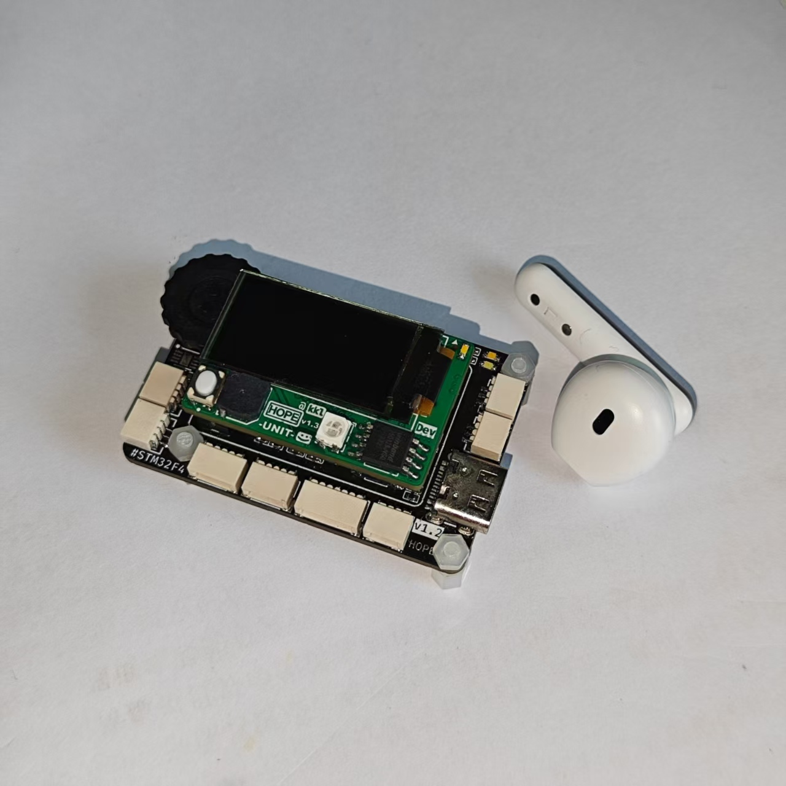
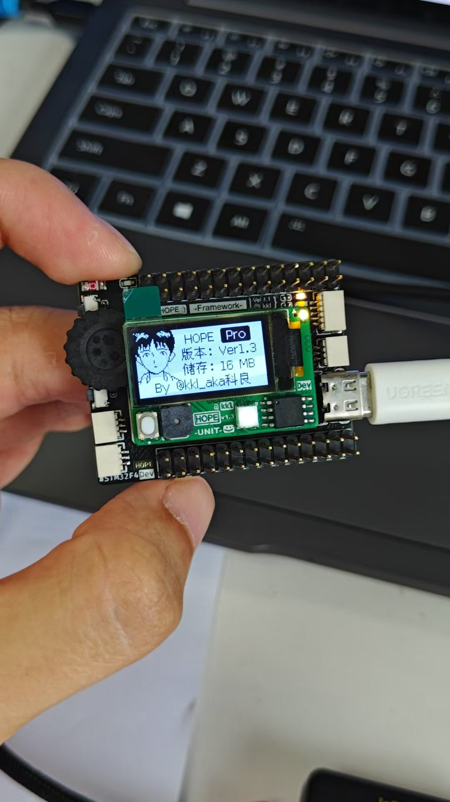

# HOPE-Link

[English](README.md) | [中文](README_CN.md)

# What it does

An offline SWD with a graphical interface.

# Hardware Resources

## Main MCU

| Item | Value |
| ----- | ----- |
| MCU | STM32F401RET6 — ARM Cortex-M4F @ 84 MHz, LQFP64, 512 KB Flash, 96 KB SRAM |
| Clock | 25 MHz HSE crystal, PLL → 84 MHz |

## Pins & Peripherals

| Pin | Peripheral | Function |
| ---- | ---------- | -------- |
| PA5 | GPIO — DAP_SWCLK | SWD clock to target |
| PA6 | GPIO — DAP_SWDIO | SWD data I/O |
| PA7 | GPIO — DAP_nRST | Target reset (open-drain) |
| PA2 | TIM5_CH3 + DMA | WS2812B RGB LED (800 kHz PWM) |
| PA3 | TIM9_CH2 | Buzzer (PWM tone) |
| PB0 / PB1 | GPIO — soft I2C | Reserved MPU6050 IMU |
| PB4 / PB5 | TIM3 (encoder) | Rotary encoder |
| PB6 / PB7 | I2C1 | OLED 128×64 (SSD1312) display |
| PB12 | GPIO — SPI2_CS | W25Q128 chip select |
| PB13 – PB15 | SPI2 | W25Q128 NOR flash (FATFS + USB disk) |
| PA9 / PA10 | USART1 | Debug log + screen mirroring |
| PA11 / PA12 | USB OTG FS | USB Mass Storage (MSC) |
| PA13 / PA14 | SWD (SYS) | On-board debug/programming port |
| PC13 | GPIO — LED | Status LED |
| PC2 | GPIO — KEY2 | Button |
| PH0 / PH1 | RCC HSE | 25 MHz external crystal |

# Compile

keil535 + CMSIS 5.8.0 + STM32F4 DFP Pack 3.1.1

# Snapshots

# License

MIT.

Star ⭐ if it saved you one scroll past one "Great question!"